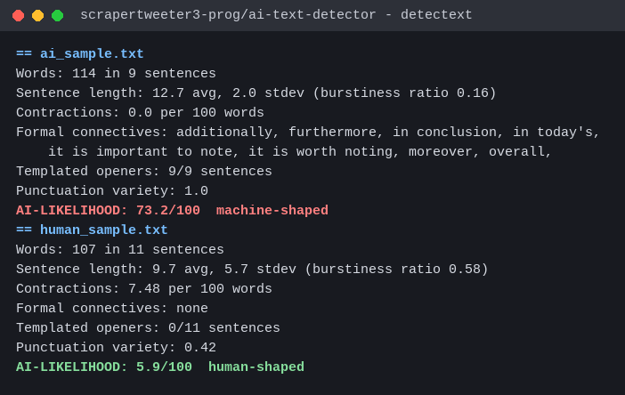

# AI Text Detector

A stylometric AI-text detector that runs entirely in your terminal. Scores any
sample of writing on a 0-100 "machine-shaped" scale using surface statistics:
sentence rhythm, contraction rate, formal-connective density, opener
templates, punctuation variety, vocabulary repetition. Standard library only:
no model files, no install, no network calls, nothing leaves your machine.



## Why surface signals

Most detectors either phone home to an API or ship a multi-gigabyte model.
Both are a problem when the text is sensitive or the machine is offline. The
useful tells are visible in plain statistics anyway: machine-shaped prose
keeps sentence lengths in a narrow band, drops contractions, leans on formal
connectives, and opens sentences from templates. detectext measures exactly
those and shows you the numbers behind every point of the score.

## What it does

- Scores a file, a folder of `.txt` files, or stdin
- 0-100 AI-likelihood score with a plain-language verdict
- Flags the specific signals that fired, with the measurements behind them
- `--json` for pipelines, `--threshold N` for a CI-friendly exit code
- 40-word floor: refuses to pretend a short fragment means anything

## Usage

```
$ python3 detectext.py ai_sample.txt human_sample.txt
== ai_sample.txt
Words: 114 in 9 sentences
Sentence length: 12.7 avg, 2.0 stdev (burstiness ratio 0.16)
Contractions: 0.0 per 100 words
Formal connectives: additionally, furthermore, in conclusion, in today's,
    it is important to note, it is worth noting, moreover, overall,
Templated openers: 9/9 sentences
Punctuation variety: 1.0
AI-LIKELIHOOD: 73.2/100  machine-shaped
  flag: flat sentence rhythm (stdev/mean 0.16)
  flag: zero contractions in the whole sample
  flag: templated openers on 9/9 sentences

== human_sample.txt
Words: 107 in 11 sentences
Sentence length: 9.7 avg, 5.7 stdev (burstiness ratio 0.58)
Contractions: 7.48 per 100 words
Formal connectives: none
Templated openers: 0/11 sentences
Punctuation variety: 0.42
AI-LIKELIHOOD: 5.9/100  human-shaped

$ python3 detectext.py --threshold 70 draft.txt   # exit 1 if it scores 70+
$ cat note.txt | python3 detectext.py
$ python3 detectext.py --json folder/*.txt
```

## The signals

| signal | weight | what it catches |
|---|---|---|
| burstiness | 28% | flat sentence-length rhythm; human prose swings between short punches and long rambles |
| formal connectives | 22% | "furthermore", "it is important to note", "in today's", "delve into" |
| contraction rate | 18% | informal human writing contracts constantly; polished output doesn't |
| templated openers | 12% | sentences that start "In today's...", "Moreover...", "Overall..." |
| punctuation variety | 10% | narrow mark palette in uniform prose |
| vocabulary repetition | 10% | rolling 100-word type-token ratio sitting near the 0.66 templated band |

## Honest limits

It is a screening tool, not a verdict. Heavily edited AI text scores lower;
idiosyncratic human writers can trip flags; and no surface statistic can
prove authorship. Use it as a first pass, read the flags, make the call
yourself.

## The writeup

How these signals behave across real samples, what they get right, and where
they quietly fail, is covered in the [PastAGI guide on building an AI text
detector with local models](https://pastagi.com/guides/build-ai-text-detector-local-models/).

[More guides](https://pastagi.com/).
